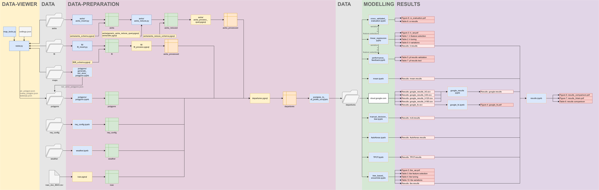
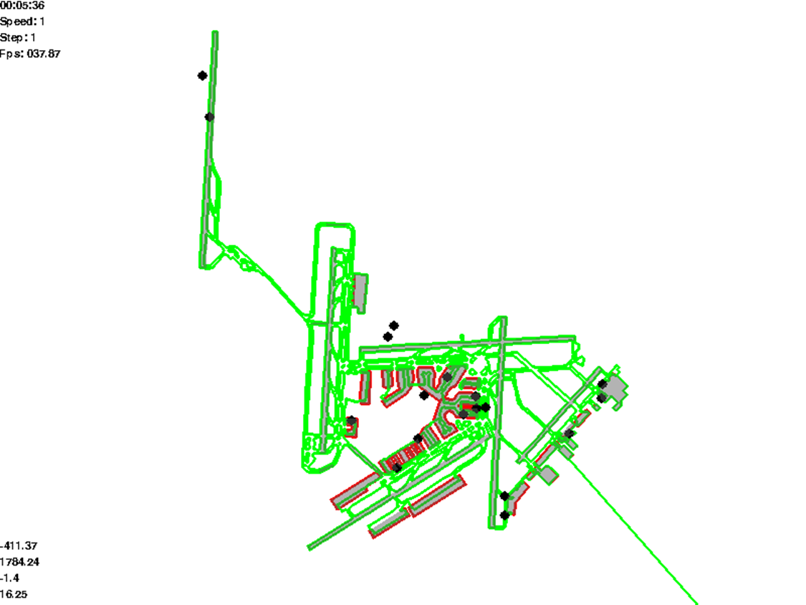

# Taxi-Time-Prediction-Schiphol-Airport

This repository contains the code for the final article "Taxi Time Prediction with Classical and Auto Machine
Learning at Schiphol Airport" of the master thesis by Christophe Vakaet.

> Note: The files in this repository have been restructured and renamed. Most of the names and file paths within the code are therefore inaccurate and broken.

## Article

The article can be found [here](http://resolver.tudelft.nl/uuid:efba9763-cb49-4f89-b19b-80ad57c65803).

### Abstract

Taxi time predictions are used by air traffic controllers to optimally release aircraft from the gate such that efficiency losses due to queuing are minimized, while runway capacity is maintained. More accurate taxi times can therefore result in improved airport surface operations and reduce air traffic controller workload. This article proposes a methodology to develop taxi time predictor and applies this methodology to Schiphol airport. The methodology combines novel data-driven predictors with different improvements and extensive performance evaluation. One such improvement involves using recent taxi time prediction errors to improve upcoming taxi time predictions. During evaluation, this article extends conventional analysis by analyzing different prediction horizons and performance metrics. Applying the methodology at Schiphol airport resulted in a predictor that increased the fraction of flights with a taxi time error of less than two minutes from 64.41% to 67.91% compared to the currently operational manual decision tree predictor.

## Code Overview

This repository is subdivided into six sections: data, data viewer, data preparation, modelling, results, and misc. The diagram above provides an overview of the links between the different sections, as well as the links between files within a section. Below each section is further detailed.

## Data

Due to intellectual property issues, most data has been redacted. However the data strcuture and description of the content are available.

## Data Viewer

The data viewer is a Python program capable of visualizing astra data together with different maps and flt data. This program has been used for multiple purposes. First the program has been used to derive the runway, taxiway, and other polygons. Secondly the program has been used to verify the results from the data preparation phase.

### Controls

|keys| function|
|-|-|
|w, a, s, d| pan|
|q, e| zoom|
|r, f| increase/decrease speed (time)|
|z| reverse time |
|space| pause |
|number keys| toggle layers |

## Data Preparation

This section contains the code that prepares the different raw data into a single departures table for modelling.

### Astra

Astra data contains the locations of all aircraft on the airport surface with one second resolution. Inserting this into a PostgreSQL table with relevant indexes results in a large table of 350 GB. To handle such a large table the data preparation for astra has been split in two.

In the first part, astra_reduced, a table is made containing only the astra entries that correspond to a change in location (polygon or queue). To these records the number of missed seconds since the previous astra entry and total number of seconds missed during the specific polygon/queue combination is appended.

To calculate this table, each entry is first linked to a track (the astra entries that relate to a single flight/vehicle). Subsequently the location (polygon and queue) of each entry is determined. Furthermore the number of missed seconds between the previous entry within the track is appended. Next, to reduce the data size, only the entries corresponding to a change in polygon or queue are kept. Lastly to these entries the total number of seconds missed in that polygon and queue combination are appended.

Calculating this query for the whole table at once turned out to be too computationally expensive. Therefore this query (astra_reduce_process_query.pgsql) is split up into multiple queries. To run the different queries a python program (astra_reduce.py) has been written. It runs the query for a section of the data and downloads the results. Subsequently these results can be uploaded into the astra_reduced table using a schema (astra_reduce_schema.pgsql).

> As the calculation of the tracks uses a sequence of entries, the calculation for a certain period also has to consider the entries before that relate to the tracks within the period (start_buffer).

In the second part, astra_processed, each entry corresponds to a single track. For each track the track_id, t_taxi (s), type (arr/dep), t_taxi_start (timestamp), t_taxi_end (timestamp), rwy, red zone, s_missed_rwy, s_missed_red_zone, t_spent (in each polygon or queue) and is calculated. Astra processed is generated as a materialized view by querying the astra_reduced table.

#### astra_insert.py

Script for parallel insertion of astra data into PostgreSQL database.

Syntax:
astra_insert.py \[number of workers\] \[offset (number of the worker)\]

#### astra_schema.pgsql

PostgreSQL schema of the astra table.

#### astra_reduce.py

Executes PostgreSQL subqueries in parallel using the generic query found in generic_astra_reduce_query.pgsql

Syntax:
astra_reduce.py \[number of workers\] \[offset (number of the worker)\]

#### astra_reduce_schema.pgsql

PostgreSQL schema of the astra_reduce table

#### generic_astra_reduce_query.pgsql

Contains the generic reduction query

#### utils.pgsql

Contains several functions used in the pgsql queries, and verification data for the queueing algorithm.

### astra_reduce_process_query.pgsql

Contains the query for the final materialized view (astra_processed). This materialized view contains a single record for each track.

### flt

As flt data is managable in size for Python using Pandas, flt data preparation commences in python before insertion into PostgreSQL. This data preparation can be found in flt_insert.py. Flt data contains every change in the data available to the tower. The script first compresses the data by only keeping the final records for a set of nearly instantaneous changes. These sets occur due to a single change triggering a chain of other changes (i.e. tobt update results in ttot update). Furthermore flt_insert.py adds several extra attributes: whether the reported actype corresponds to a landplane according to ICAO doc 8643, whether the flight has civilian registration or gatenumber, the most accurate off-block time prediction (tobt else eobt else sobt), and the most accurate arrival time (slot else eta).

Next the table inserted by flt_insert.py is processed into a materialized view using the flt_process.pgsql query. This query links each flt records to a single flight. Furthermore it identifies whether a flight flew or got cancelled, and determines when each record was active in the tower (valid_range).

#### flt_insert.py

Script for parallel insertion of flt data into PostgreSQL database. Additonally the data is slightly compressed and attributes are added, see previous paragraphs.

Syntax:
flt_insert.py \[number of workers\] \[offset (number of the worker)\]

#### flt_schema.pgsql

PostgreSQL schema of the flt table.

#### flt_process.pgsql

Contains the query for the final materialized view (flt_processed). This materialized view contains a single record for each flight.

## Modelling

This section contains the code for the different taxi time prediction models. The code additionally generates the performance results for the evaluation of the different models.

## Results

This section contains and additionally evaluates the results of the modelling phase.

## Misc

Two extra files have been added to the repository that contain some extra information:

* verification.ipynb
* queueing.ipynb

### verification.ipynb

Verfiication.ipynb contains queries to verify different aspects of the data preparation phase.

### queueing.ipynb

Queuing.ipynb contains analysis of the queueing data from the data preparation phase. The goal was to link potentially link taxi time, and taxi time prediction error with the calculated average queue times. The quick analysis performed in this file is however unable to find such a link. More investigation is required.

## Redacted

Multiple files had to be redacted in this repository due to intellectual property rights. The files are replaced by redacted&#46;md files describing the content removed.

## To Do

* redo file paths and names
* verify code with new architecture (rerun)
* eliminate duplicate code (modelling)
